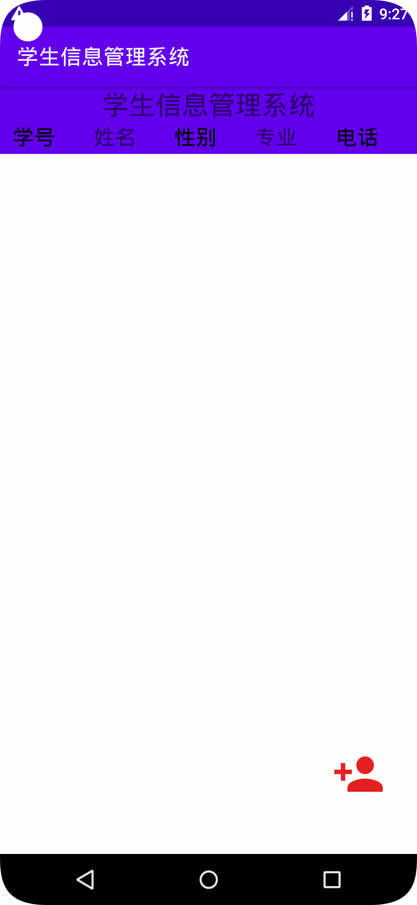
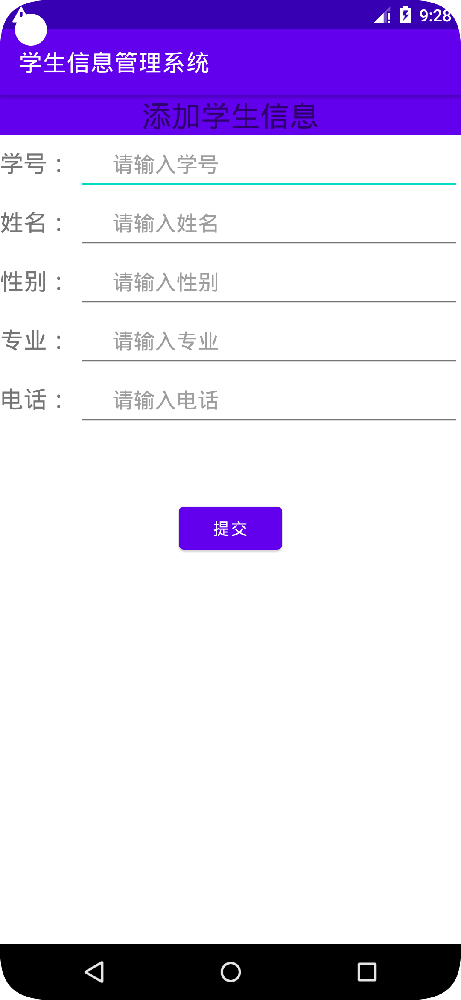
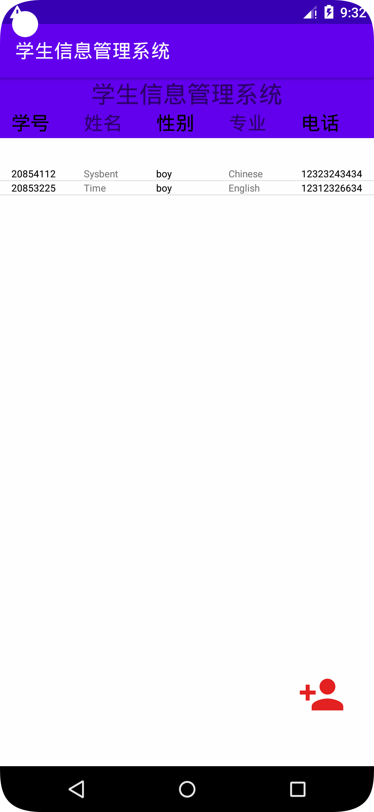

# StudentInformationManagementSystem
### StudentInformationManagementSystem（学生信息管理系统）

##### 本系统是学生信息管理系统课设
使用的技术有：
- SQLite
- 自定义适配器 + ListView
- 使用了两个Activitys + 界面跳转

## 代码注释清晰便于理解可用于学习使用

### 介绍

主页： 

添加界面：

添加成功后：